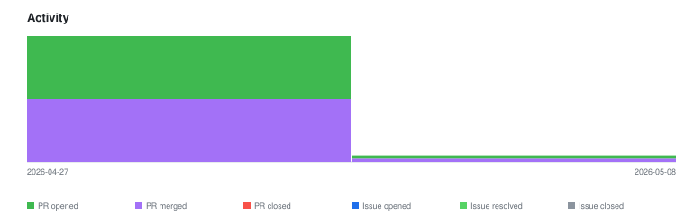

# qte77/.github — Timeline

<!-- activity-svg-embed -->

## 2026-04-29

- [PR #21] docs(lint): recommend markdownlint-cli2 for local linting (2026-04-27) [closed]
- [PR #20] ci(lint): skip markdown job on scheduled runs (2026-04-27) [closed]
- [PR #17] ci(lint): add weekly self-schedule and document propagation (2026-04-27) [closed]
- [PR #16] feat(ci): add notify_on_failure input for scheduled monitoring (2026-04-27) [closed]
- [PR #15] docs(security): expand policy with best-practice sections (2026-04-27) [closed]
- [PR #14] docs(readme): document caller SHA pinning policy (2026-04-27) [closed]
- [PR #13] docs(readme): document cascade is UI-only (2026-04-27) [closed]
- [PR #12] chore(lint): rename workflow, document in README, frontmatter-aware MD041 (2026-04-27) [closed]
- [PR #11] chore(ci): rename workflow to 'Lint MD and Links' (2026-04-27) [closed]
- [PR #10] refactor(ci): simplify reusable lint workflow with SHA-pinned actions (2026-04-27) [closed]
- [PR #9] feat(ci): make lint workflow reusable via workflow_call (2026-04-27) [closed]
- [PR #8] ci(lint): add markdown + link-check workflow (2026-04-27) [closed]
- [PR #7] chore(lint): add markdownlint and lychee configs (2026-04-27) [closed]
- [PR #6] docs(readme): reflect undrafted files and license templates (2026-04-27) [closed]
- [PR #5] feat(discussions): undraft DISCUSSION_TEMPLATE forms (2026-04-27) [closed]
- [PR #4] feat(governance): undraft GOVERNANCE.md to enable cascade (2026-04-27) [closed]
- [PR #3] docs(coc): rewrite for pragmatic technical tone (2026-04-27) [closed]
- [PR #2] chore(license): add Apache-2.0 LICENSE and NOTICE templates (2026-04-27) [closed]
- [PR #1] docs(readme): list cascading files with 1p docs links (2026-04-27) [closed]
## 2026-05-08

- [PR #24] feat(ci): add reusable bump-version workflow (2026-05-08) [closed]
