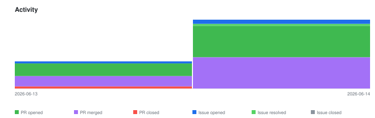

# qte77/agentic-codebase-to-scientific-report — Timeline

<!-- activity-svg-embed -->

## 2026-06-14

- [ISSUE #23] Cleanup: drop MkDocs (over-engineered for a 5-page docs set); keep docs/ as GitHub-rendered (2026-06-14) [open]
- [ISSUE #12] TODO agents: output paths conflict with active pipeline conventions (2026-06-14) [closed]
- [ISSUE #5] Follow-ups: deferred security & pipeline tasks (2026-06-13) [open]
- [PR #25] docs(changelog): record the #18-#24 doc/governance/CI work (2026-06-14) [closed]
- [PR #24] docs(plans): add docs/plans/ for open tasks; reference from roadmap + issues (2026-06-14) [closed]
- [PR #22] ci: single .markdownlint.jsonc config (drop cli2 file), keep recursive CI (2026-06-14) [closed]
- [PR #21] ci: use .markdownlint.jsonc so local and CI lint match (2026-06-14) [closed]
- [PR #20] ci: add CodeQL (actions) workflow + issue templates (2026-06-14) [closed]
- [PR #19] docs: restructure README as audience-segmented navigation (2026-06-14) [closed]
- [PR #18] docs: governance layer (CONTRIBUTING + Documentation Hierarchy, AGENTS restructure, AGENT_LEARNINGS/REQUESTS) (2026-06-14) [closed]
- [PR #17] docs: MkDocs site (architecture, user story, roadmap, how-to) + CHANGELOG (2026-06-14) [closed]
- [PR #16] chore: legal + commit foundation (LICENSE, .gitmessage, CLAUDE shim, writeup fix) (2026-06-14) [closed]
- [PR #15] docs: sync README + AGENTS with schema contract and test targets (2026-06-14) [closed]
- [PR #14] fix(agents): align TODO-agent paths + add path-convention guard (2026-06-14) [closed]
- [PR #13] feat(schema): enforce ISO YYYY-MM-DD dates (TDD) (2026-06-14) [closed]
- [PR #11] test(schema): enforce asset-path contract + expand TDD suite (2026-06-14) [closed]
- [PR #10] fix(make): stop double-loading ingested context in analyze (2026-06-14) [closed]
- [PR #9] feat: define analysis.yaml schema contract (TDD + CI) (2026-06-14) [closed]
- [PR #8] ci: drop reviewdog/action-actionlint step (lint locally) (2026-06-13) [closed]
- [PR #7] ci(security): pin actions to latest stable release SHAs (2026-06-13) [closed]
- [PR #6] chore: pin Makefile runtime deps + drop empty CSL stubs (2026-06-13) [closed]
- [PR #4] chore(ci): Bump the github-actions group with 2 updates (2026-06-13) [closed]
- [PR #3] security: adopt repo-baseline hardening + org lint-md-links (2026-06-13) [closed]
- [PR #2] feat: make codebase→scientific-report pipeline run end-to-end (2026-06-13) [closed]
