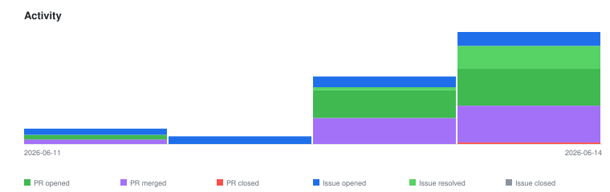

# qte77/agentic-job-offer-to-application-kit — Timeline

<!-- activity-svg-embed -->

## 2026-06-14

- [ISSUE #57] docs: structural-integrity pass (rigor, DRY, scope separation) (2026-06-14) [closed]
- [ISSUE #56] feat(prefill): application-question schema reach beyond Greenhouse (2026-06-14) [open]
- [ISSUE #55] feat(stage3): structured JD must-have coverage report in the tailor pass (2026-06-14) [open]
- [ISSUE #54] chore: full L1 org-settings apply (branch protection + broader SHA allowlist) (2026-06-14) [open]
- [ISSUE #53] test: per-adapter error/edge handling + error-branch coverage for ingest adapters (2026-06-14) [open]
- [ISSUE #52] feat: pseudonymize-text helper (PII-gate enabler for shared/public corpora) (2026-06-14) [open]
- [ISSUE #50] Stage-3: build the prefill-pack artifact (human-submit, no auto-apply) (2026-06-14) [closed]
- [ISSUE #45] Consolidate markdownlint config: why both .markdownlint-cli2.jsonc and .markdownlint.jsonc? (2026-06-14) [closed]
- [ISSUE #38] Reference the canonical Apache-2.0 license URL (2026-06-14) [closed]
- [ISSUE #35] Add CONTRIBUTING.md (2026-06-13) [closed]
- [ISSUE #34] CI: paths-ignore for docs-only changes (without breaking required checks) (2026-06-13) [closed]
- [ISSUE #33] Add a coverage gate (pytest-cov) to make check (2026-06-13) [closed]
- [ISSUE #31] Support i18n / locale-aware pre-filter keywords (2026-06-13) [open]
- [ISSUE #22] Align root README badges with the qte77 default badge set (2026-06-13) [closed]
- [ISSUE #19] Make ingest/chunk/persist/slug_probe workspace-root aware (consistent with cc-workflow-relevance rootDir) (2026-06-13) [closed]
- [ISSUE #16] Stage 3: tailor CVs/letters in the user's writing style or a set tone (user CV + cover-letter config inputs) (2026-06-13) [closed]
- [ISSUE #12] Spec locale-aware document conventions (CV / cover letter) (2026-06-12) [open]
- [ISSUE #11] Static gh-pages dashboard: job-market keyword/skill trends over time (2026-06-12) [open]
- [ISSUE #10] Add a structured job-sources catalog to research.md (2026-06-12) [closed]
- [ISSUE #9] Build the ats-check: resume parse-safety verification (2026-06-12) [closed]
- [ISSUE #8] Stage-3 delivery: pre-fill pack (human-submit) over auto-apply — verify the ToU/CFAA claims (2026-06-12) [closed]
- [ISSUE #7] Specify the relevance stage: three-piece Stage-2 + batched per-lane scoring fan-out (2026-06-11) [closed]
- [ISSUE #6] Add ATS slug-discovery tool for building the ingest seed (2026-06-11) [closed]
- [ISSUE #5] Build lib/ingest.py: no-auth ATS/feed adapters + structured pre-filter + tier monitoring (2026-06-11) [closed]
- [ISSUE #4] Adopt cc-workflow-*.js naming + document batch-control invocation args (2026-06-11) [closed]
- [PR #70] docs: add docs/plans/backlog.md execution plan + reconcile roadmap (2026-06-14) [closed]
- [PR #69] ci: use the org reusable lint-md-links workflow (2026-06-14) [closed]
- [PR #68] docs: move writing-style usage to README (#57 SEP-3) (2026-06-14) [closed]
- [PR #67] docs: add structured job-sources board catalog (#10) (2026-06-14) [closed]
- [PR #66] docs: align README badges with the qte77 default set (#22) (2026-06-14) [closed]
- [PR #65] docs: add CONTRIBUTING.md (#35) (2026-06-14) [closed]
- [PR #64] docs: add scope cross-references for AGENTS/README boundaries (#57) (2026-06-14) [closed]
- [PR #63] docs: dedup shared invariants to single sources of truth (#57) (2026-06-14) [closed]
- [PR #62] docs: fix stale Stage-3 claims that contradicted shipped code (#57) (2026-06-14) [closed]
- [PR #61] ci: skip CI/CodeQL for docs-only changes (#34) (2026-06-14) [closed]
- [PR #60] test(ci): add pytest-cov coverage floor to make check (#33) (2026-06-14) [closed]
- [PR #59] ci(docs): fix links job — exclude EU citation URLs that 403 CI runners (2026-06-14) [closed]
- [PR #58] chore(lint): consolidate markdownlint config (#45) (2026-06-14) [closed]
- [PR #51] feat(stage3): prefill-pack artifact + Stage-3 docs sync (#50) (2026-06-14) [closed]
- [PR #49] docs(readme): reflect shipped Stage-3 + full CLI subcommand set (2026-06-14) [closed]
- [PR #48] docs: drop Apache LICENSE APPENDIX section (end at END OF TERMS AND CONDITIONS) (2026-06-14) [closed]
- [PR #47] docs: drop Apache LICENSE APPENDIX section (end at END OF TERMS AND CONDITIONS) (2026-06-14) [closed]
- [PR #46] feat(stage3): writing style / tone for the tailor pass (#16) (2026-06-14) [closed]
- [PR #44] docs(research): cited Delivery safety note (#8) (2026-06-14) [closed]
- [PR #43] docs: trim Apache LICENSE appendix (remove how-to-apply instructions) (2026-06-14) [closed]
- [PR #42] docs(research): no-auth ATS feed/API endpoint table (#5) (2026-06-14) [closed]
- [PR #41] feat(stage3): ats-check résumé parse-safety (#9) (2026-06-14) [closed]
- [PR #40] feat(stage3): tailor-offer application pack — first vertical slice (2026-06-14) [closed]
- [PR #39] chore: fill Apache-2.0 LICENSE copyright line (2026 qte77) (2026-06-14) [closed]
- [PR #37] ci: bump markdownlint-cli2-action v23.0.0 -> v23.2.0 (latest stable) (2026-06-13) [closed]
- [PR #36] docs: align tooling docs + backfill changelog fragments (#26/#27/#29/#30) (2026-06-13) [closed]
- [PR #32] refactor: English-only pre-filter keywords (drop hardcoded DE; i18n -> #31) (2026-06-13) [closed]
- [PR #30] ci: add lint-md-links workflow (org reusable) + split markdownlint config (2026-06-13) [closed]
- [PR #29] build: add pyright + complexipy quality gates (wired into make check) (2026-06-13) [closed]
- [PR #28] chore(deps): bump pytest from 9.0.3 to 9.1.0 in the python-deps group across 1 directory (2026-06-13) [closed]
- [PR #27] chore: repo hygiene — SECURITY.md, .editorconfig, CODEOWNERS, dependabot (2026-06-13) [closed]
- [PR #26] ci: harden GitHub Actions (deny-all permissions, concurrency, timeouts) (2026-06-13) [closed]
- [PR #25] build: adopt scriv changelog.d/ fragments (mirror analyze-stock-kpi) (2026-06-13) [closed]
- [PR #24] docs: align roadmap/architecture/README/userstory with ADR-0001 L1/L2 (2026-06-13) [closed]
- [PR #23] feat: AppSettings backend + ajoa-kit CLI (ADR-0001 L1/L2 separation) (2026-06-13) [closed]
- [PR #21] docs: drive README How with make recipes (user run + example) (2026-06-13) [closed]
- [PR #20] build: concise Makefile (.ONESHELL/.SILENT, default help); CI via make check (2026-06-13) [closed]
- [PR #18] refactor: self-contained example workspace (config/ + results/) under examples/alexis-doe (2026-06-13) [closed]
- [PR #17] docs: track #16 (style/tone tailoring) in roadmap, userstory, architecture (2026-06-13) [closed]
- [PR #15] chore: docs (roadmap/userstory/architecture) + config/examples relocation + drop NOTICE (2026-06-13) [closed]
- [PR #14] chore(ci): bump the github-actions group with 2 updates (2026-06-13) [closed]
- [PR #13] feat: slice core pipeline (ingest → relevance) into the kit, baseline-conformant (2026-06-13) [closed]
- [PR #3] docs: link polyfetch-scrape repo in ad-hoc usage note (2026-06-11) [closed]
- [PR #2] docs: run polyfetch without installing (uv run --directory) (2026-06-11) [closed]
- [PR #1] docs: concept — Stage-1 workflow + design for the application kit (2026-06-11) [closed]
