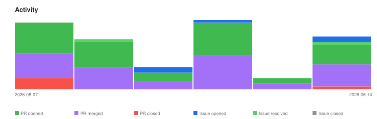

# qte77/ai-agents-research — Timeline

<!-- activity-svg-embed -->

## 2026-06-14

- [ISSUE #243] docs: re-apply un-merged PR #206 content against current main (2026-06-14) [open]
- [ISSUE #242] fix(docs): Langtrace URL relocated (404) — update entry + drop lychee exclude (2026-06-14) [open]
- [ISSUE #232] Defer: scheduled auto-refresh workflow for the graphify Pages graph (2026-06-11) [open]
- [ISSUE #219] Research: catalog third-party deep-research agents and map them to the CC deep-research harness (2026-06-10) [closed]
- [ISSUE #217] Defer: adopt changelog.d fragment workflow (towncrier/scriv) until CHANGELOG.md conflicts recur (2026-06-10) [open]
- [ISSUE #191] research backlog: pending agent analyses + comparison topics (from docs/TODO.md) (2026-05-26) [open]
- [ISSUE #186] chore(ci): SHA-pin all GitHub Actions in lint.yaml and rxiv-paper-eval.yaml for supply-chain hardening (2026-05-25) [closed]
- [PR #244] docs(plans): establish docs/plans/ convention + triage open tasks to issues (2026-06-14) [closed]
- [PR #241] docs(research): map deep-research agents to CC /deep-research harness (2026-06-14) [closed]
- [PR #240] docs(non-cc): fold Devstral into frameworks-infra Foundation Models section (2026-06-14) [closed]
- [PR #239] docs(learnings): record subagent ref-sweep false-negative pattern (2026-06-14) [closed]
- [PR #238] docs: split oversized model-provider + tooling landscapes into topic files (2026-06-14) [closed]
- [PR #237] docs: add AgentCanvas/MemSearch/Infomaniak + fold archive catalogs into live docs (2026-06-14) [closed]
- [PR #236] docs: drop Apache LICENSE APPENDIX section (end at END OF TERMS AND CONDITIONS) (2026-06-14) [closed]
- [PR #235] fix(lychee): exclude timeout-prone techsy.io domain (2026-06-13) [closed]
- [PR #234] docs(non-cc): add SearXNG, deepagents, and Autonomous Robots analyses (2026-06-13) [closed]
- [PR #233] docs: add AgentSeal + Understand Anything, cite CodeBurn optimize source (2026-06-11) [closed]
- [PR #231] docs(graphify): on-demand knowledge graph — docs, make recipes, gh-pages publish (2026-06-11) [closed]
- [PR #230] docs: add as-of date + version gate to Effort Levels section (2026-06-11) [closed]
- [PR #229] docs: document the full /effort levels + fix stale xhigh-missing rows (2026-06-11) [closed]
- [PR #228] docs: document /workflows command + re-stamp two session frontmatters (2026-06-11) [closed]
- [PR #227] docs: add Firecrawl Prometheus to web-scraping analysis (2026-06-11) [closed]
- [PR #226] docs: document dynamic workflows, ultracode & /deep-research in cc-native (2026-06-11) [closed]
- [PR #225] docs: refresh Goose analysis for the AAIF move (block/goose → aaif-goose/goose) (2026-06-11) [closed]
- [PR #224] docs: drop unverified polyfetch cross-reference from web-tools note (2026-06-11) [closed]
- [PR #223] docs: document native web tool (WebFetch/WebSearch) constraint floor (2026-06-11) [closed]
- [PR #222] docs: disambiguate Anthropic design offerings + extend first-party repo index (2026-06-11) [closed]
- [PR #221] docs: add GitHub Copilot CLI analysis + catalog graphify coding agents (2026-06-11) [closed]
- [PR #220] docs(cc-community): refresh openclaude (v0.18.0, 28.6K stars, gRPC) (2026-06-10) [closed]
- [PR #218] docs(cc-native): document Claude Code Router (CCR) in provider config (2026-06-10) [closed]
- [PR #216] docs: add Claude Fable 5 + 5 codebase-analysis tools (2026-06-10) [closed]
- [PR #215] chore: bump qte77/gha-issue-triage from 0.2.4 to 0.3.0 in the actions group across 1 directory (2026-06-08) [closed]
- [PR #214] chore(ci): add Dependabot github-actions version updates (2026-06-08) [closed]
- [PR #213] fix(ci): tighten changelog-monitor coverage matching + document triaged CC features (2026-06-08) [closed]
- [PR #212] chore(ci): SHA-pin GitHub Actions for supply-chain hardening (2026-06-08) [closed]
- [PR #211] docs: add 5 ecosystem sources to landscape docs (2026-06-08) [closed]
- [PR #210] chore(tooling): allowlist read-only gh/git commands in CC settings (2026-06-08) [closed]
- [PR #209] chore: learnings aggregation 2026-06-08 (2026-06-08) [closed]
- [PR #208] chore: community triage 2026-06-08 (2026-06-08) [closed]
- [PR #207] chore: outage archive update 2026-06-08 (2026-06-08) [closed]
- [PR #206] docs: CodeBurn rules, Devstral, GitHub App provenance, llms-full.txt (2026-06-07) [closed]
- [PR #205] chore: relocate rxiv index to docs/, drop empty community artifacts (2026-06-07) [closed]
- [PR #204] chore: rxiv paper triage 2026-06-07 (2026-06-07) [closed]
- [PR #203] feat(rxiv): persist eval results as JSONL + cumulative index (2026-06-07) [closed]
- [PR #202] docs(remote-control): correct status + add allowlist, push, flags (2026-06-07) [closed]
- [PR #201] chore: rxiv paper triage 2026-06-07 (2026-06-07) [closed]
- [PR #200] fix(ci): resolve latest available feed week for rxiv eval (2026-06-07) [closed]
- [PR #199] chore: changelog triage 2026-06-07 (catch-up v2.1.82→latest) (2026-06-07) [closed]
- [PR #198] fix(ci): harden monitor error handling, community path, and triage PR body cap (2026-06-07) [closed]
- [PR #197] fix(docs): repair lychee link-check failures (dead + bot-blocked URLs) (2026-06-07) [closed]
- [PR #196] ci(changelog-monitor): fix stale scan-doc path breaking weekly runs (2026-06-07) [closed]
- [PR #195] chore: learnings aggregation 2026-06-01 (2026-06-01) [closed]
- [PR #194] chore: community triage 2026-06-01 (2026-06-01) [closed]
- [PR #193] chore: outage archive update 2026-06-01 (2026-06-01) [closed]
- [PR #142] docs: research updates — /install-github-app, Devstral, HuggingScience, CodeBurn rules, BASH cap (2026-04-30) [closed]
