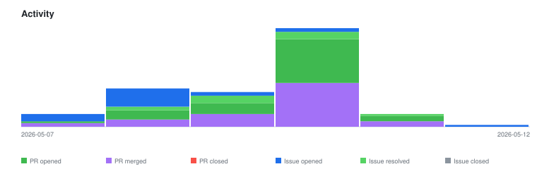

# qte77/analyze-stock-kpi — Timeline

<!-- activity-svg-embed -->

## 2026-05-12

- [ISSUE #59] feat(demo): GitHub Pages dashboard for CNN F&G + weekly fundamentals snapshots (2026-05-12) [open]
- [ISSUE #55] research: alternatives to Mansfield Relative Strength (2026-05-10) [closed]
- [ISSUE #43] fix(yfinance): dividend_yield is shipped as percentage, code assumes fraction (2026-05-10) [closed]
- [ISSUE #23] research: when to revisit pandas as the DataFrame engine (2026-05-09) [open]
- [ISSUE #22] research: alternative risk-sentiment sources (UBS, AAII, NAAIM, etc.) (2026-05-09) [open]
- [ISSUE #21] research: TradingView screener API for technical signals (2026-05-08) [open]
- [ISSUE #20] feat: broaden asset universe (stocks + ETFs + currencies + commodities) (2026-05-08) [closed]
- [ISSUE #19] chore: decommission Traderfox scraper (Phase D) (2026-05-08) [closed]
- [ISSUE #18] feat: composite proxy scores for Traderfox aggregates (Phase C) (2026-05-08) [closed]
- [ISSUE #17] feat: CNN Fear & Greed sentiment + scheduled workflow (Phase B) (2026-05-08) [closed]
- [ISSUE #16] feat: library-based fundamentals module (Phase A) (2026-05-08) [closed]
- [ISSUE #10] feat(rs): capability 4 — long/short ranking + output (2026-05-08) [open]
- [ISSUE #9] feat(rs): capability 3 — regime-split returns (2026-05-08) [open]
- [ISSUE #8] feat(rs): capability 2 — Mansfield Relative Strength (2026-05-08) [open]
- [ISSUE #7] feat(rs): capability 1 — price fetch via yfinance (2026-05-08) [closed]
- [ISSUE #6] chore: cleanup orphaned files (.bumpversion.cfg, make.bat, Pipfile ghost, MEMORY.md gitignore) (2026-05-07) [closed]
- [ISSUE #5] chore: gate pyright in `make validate` (2026-05-07) [closed]
- [ISSUE #4] feat: relative-strength / long-short hedging analysis (2026-05-07) [open]
- [ISSUE #3] docs: cleanup README (badges, drop DRAFT/WIP, fill empty sections) (2026-05-07) [closed]
- [PR #58] chore(gitignore): ignore results/fundamentals_*.json runtime artifacts (2026-05-11) [closed]
- [PR #57] docs: update SBOM (2026-05-11) [closed]
- [PR #56] docs: defer v0.6.0 RS hedging epic per ADR-0003 (2026-05-11) [closed]
- [PR #54] docs: update SBOM (2026-05-10) [closed]
- [PR #53] chore(release): bump 0.5.0 -> 0.5.1 (2026-05-10) [closed]
- [PR #52] fix(ci): bump workflow push step + roadmap/UserStory for v0.5.1 (2026-05-10) [closed]
- [PR #51] fix(fundamentals): normalize dividend_yield at fetch boundary (#43) (2026-05-10) [closed]
- [PR #50] chore(lychee): drop SBOM-badge exclusion (2026-05-10) [closed]
- [PR #49] docs: update SBOM (2026-05-10) [closed]
- [PR #48] chore: rename to analyze-stock-kpi + add llms.txt + SBOM workflow (2026-05-10) [closed]
- [PR #47] ci/security: CodeQL + Dependabot; fix Bandit B310 (2026-05-10) [closed]
- [PR #46] feat: regional presets + bumpversion + dev-env badges; drop dax40 (2026-05-10) [closed]
- [PR #45] docs(readme): condense for actionability; drop TOC + Status (2026-05-10) [closed]
- [PR #44] fix(make) + docs: SHOW_SCORES var + #43 follow-up (2026-05-10) [closed]
- [PR #42] feat(composites): add 6 proxy scores + CompositeScores model (#18) (2026-05-10) [closed]
- [PR #41] chore(watchlist): replace delisted ANSS->SNPS, HES->CVX (2026-05-10) [closed]
- [PR #40] docs(readme): clean up for v0.4.0 release; dynamic version source (#3) (2026-05-10) [closed]
- [PR #39] chore: drop now-stale app/results/ gitignore line (2026-05-10) [closed]
- [PR #38] refactor(rename): rename top-level package app/ -> src/ (2026-05-10) [closed]
- [PR #37] fix(sentiment): backfill subindicators + drop null fields (#17) (2026-05-10) [closed]
- [PR #36] feat(sentiment): capture all 9 CNN subindicators per day (#17) (2026-05-10) [closed]
- [PR #35] docs(sentiment): observed CNN F&G API schema reference (#17) (2026-05-10) [closed]
- [PR #34] refactor(sentiment): per-year history files results/cnn_fg/YYYY.json (#17) (2026-05-10) [closed]
- [PR #33] feat(sentiment): historical backfill + relocate to results/cnn_fg/ (#17) (2026-05-10) [closed]
- [PR #32] fix(sentiment): add Referer header for CNN WAF (#17 hot-fix #2) (2026-05-10) [closed]
- [PR #31] fix(sentiment): real browser User-Agent for CNN F&G (#17 hot-fix) (2026-05-10) [closed]
- [PR #30] feat: CNN Fear & Greed sentiment + daily cron (PR 1E, closes #17) (2026-05-10) [closed]
- [PR #29] docs(audit): align AGENTS.md + docs/ with post-#28 reality (2026-05-09) [closed]
- [PR #28] feat: yfinance fundamentals + delete dead config layer (PR 1D, closes #16, supersedes #7) (2026-05-09) [closed]
- [PR #27] chore(lint): adopt qte77 markdownlint convention (atx + JSON config) (2026-05-09) [closed]
- [PR #26] feat: universe layer + pydantic CLI (Phase 1C, closes #20) (2026-05-09) [closed]
- [PR #25] chore: decommission Traderfox scraper (Phase 1B, closes #19) (2026-05-09) [closed]
- [PR #24] chore: governance scaffold + complexity gates (Phase 1A) (2026-05-09) [closed]
- [PR #15] fix: runtime bugs surfaced by make run (orphan kwarg + mkdir results) (2026-05-08) [closed]
- [PR #14] chore: Apache-2.0 license + README badge cleanup + make run target (2026-05-08) [closed]
- [PR #13] fix(types): clear 22 pyright errors and gate type checking in CI (closes #5) (2026-05-08) [closed]
- [PR #12] chore: cleanup orphaned files (closes #6) (2026-05-08) [closed]
- [PR #11] chore(claude): enable tdd-core, makefile-core, planning, readme-generator (2026-05-08) [closed]
- [PR #2] chore: adopt qte77 ecosystem conventions (uv, ruff, pyright, Makefile, AGENTS.md, CI) (2026-05-07) [closed]
- [PR #1] chore(deps): Bump lycheeverse/lychee-action from 1.4.1 to 2.0.2 in /.github/workflows in the github_actions group across 1 directory (2025-08-28) [closed]
