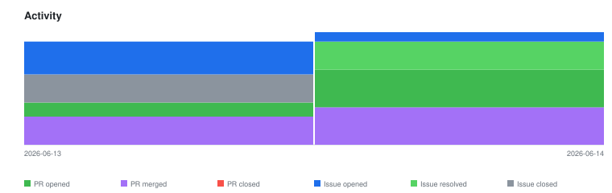

# qte77/coding-agent-eval — Timeline

<!-- activity-svg-embed -->

## 2026-06-14

- [ISSUE #37] future: re-evaluate Ralph loop for long-running E2E agent tasks (2026-06-14) [open]
- [ISSUE #34] infra: M2 fixture delivery — single SUT git repo with ref pairs (defer from M1) (2026-06-14) [open]
- [ISSUE #27] security: harden ralph agent-execution threat surface (2026-06-13) [closed]
- [ISSUE #26] security: pluggable agent Sandbox backend (aim T2 cloud microVM, fallback T1) (2026-06-13) [open]
- [ISSUE #25] security: adopt repo-baseline CI/supply-chain hardening (2026-06-13) [open]
- [ISSUE #24] feat: Phase-1 harness — models, collectors, graders, runner, specs, compare (2026-06-13) [open]
- [ISSUE #23] design: lock spec.json schema (runner↔specs contract) (2026-06-13) [closed]
- [ISSUE #22] spike: de-risk dependencies before harness build (2026-06-13) [open]
- [ISSUE #21] chore: repo hygiene — merge chore PRs, migrate license, dedup issues (2026-06-13) [closed]
- [ISSUE #19] fix: update LICENSE.md reference to LICENSE in README (2026-04-19) [closed]
- [ISSUE #12] feat: graders — validate (make validate) + diff (git diff) (2026-03-24) [open]
- [ISSUE #10] feat: Claude Code collector — Collector ABC + cc_collector.py (2026-03-24) [open]
- [ISSUE #9] feat: Pydantic models — HarnessConfig, SpecConfig, SpecResult, GraderResult (2026-03-24) [closed]
- [ISSUE #8] feat: scaffold pyproject.toml with cc-recursive-team-mode dependency (2026-03-24) [closed]
- [ISSUE #7] Comparison + reporting (compare.py, run-comparison.sh, phase2 configs) (2026-03-23) [closed]
- [ISSUE #5] Graders + specs (validate_grader, diff_grader, S01-S03 specs) (2026-03-23) [closed]
- [ISSUE #4] Collectors + runner (base ABC, cc_collector, generic_collector, runner.py) (2026-03-23) [closed]
- [ISSUE #3] Recursive CC harness (cc-recursive-team.sh + cc_recursive.py) (2026-03-23) [closed]
- [ISSUE #2] Harness data models (HarnessConfig, RunResult, SpecResult, GraderResult) (2026-03-23) [closed]
- [ISSUE #1] Scaffold coding-agent-eval repo (template, submodules, push) (2026-03-23) [closed]
- [PR #40] docs: Phase-1 harness roadmap (prioritized open work) (2026-06-14) [closed]
- [PR #39] feat: validate + scope graders with Grader ABC (TDD) (2026-06-14) [closed]
- [PR #38] chore: remove residual Ralph references (skills + docs) (2026-06-14) [closed]
- [PR #36] chore: remove Ralph loop tooling and .ralph-template submodule (2026-06-14) [closed]
- [PR #35] feat: lock spec.json schema (M1) + expected_solution naming (#23) (2026-06-14) [closed]
- [PR #33] docs: drop Apache LICENSE APPENDIX section (end at END OF TERMS AND CONDITIONS) (2026-06-14) [closed]
- [PR #32] feat: phase-1 scaffold + AgentBeats Pydantic models (TDD) (2026-06-14) [closed]
- [PR #31] docs: rename LICENSE.md → LICENSE and update refs (2026-06-14) [closed]
- [PR #30] chore: repo hygiene — .gitignore + SECURITY.md (2026-06-13) [closed]
- [PR #29] ci: pin GitHub Actions to latest-stable full-length commit SHAs (2026-06-13) [closed]
- [PR #28] docs: add 2026-06 landscape, security & sandbox research (2026-06-13) [closed]
- [PR #18] chore: migrate license to Apache-2.0 (2026-03-27) [closed]
- [PR #17] chore: update coding-agents-research → ai-agents-research (2026-03-25) [closed]
- [PR #16] chore: standardize repo scaffold (2026-03-24) [closed]
