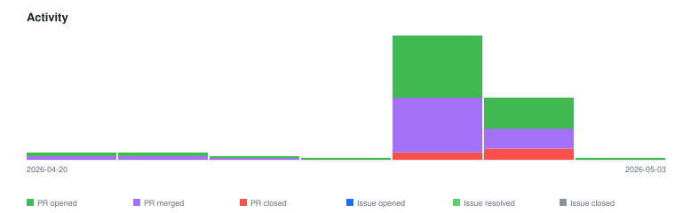

# qte77/doc-pipeline-engine — Timeline

<!-- activity-svg-embed -->

## 2026-04-29

- [PR #61] feat: external one-shot evaluators (Anthropic SDK + CC CLI) (§0.2.3 PR B) (2026-04-27) [open]
- [PR #60] chore(lint): bump SHA pin and apply inference fixes (2026-04-27) [closed]
- [PR #59] docs: update SBOM (2026-04-27) [closed]
- [PR #58] revert(ci): remove lint-monitor scaffold (2026-04-27) [closed]
- [PR #57] docs: update SBOM (2026-04-27) [closed]
- [PR #56] docs: update SBOM (2026-04-27) [closed]
- [PR #55] ci(lint): bump SHA pin and add scheduled monitor (2026-04-27) [closed]
- [PR #54] chore: rename pipeline legs (v1→anthropic_sdk, v2→local) (§0.2.3 PR A) (2026-04-27) [closed]
- [PR #53] docs: update SBOM (2026-04-27) [closed]
- [PR #52] ci(lint): adopt centralized markdown + link checking (2026-04-27) [closed]
- [PR #51] fix(docs): show Claude Code CLI fallback in V1 lane label (2026-04-27) [closed]
- [PR #50] docs: update SBOM (2026-04-27) [closed]
- [PR #49] feat(docs): mkdocs site + docstrings + architecture SVG (§0.2.2) (2026-04-27) [closed]
- [PR #48] docs: update SBOM (2026-04-27) [closed]
- [PR #47] feat(models): Pydantic v2 contracts (§0.2.1) (2026-04-27) [closed]
- [PR #46] docs: update SBOM (2026-04-27) [closed]
- [PR #45] chore(cascade): remove redundant community files (2026-04-27) [closed]
- [PR #44] docs: update SBOM (2026-04-26) [closed]
- [PR #43] feat(stages): v2_normalize reconstructs heading tree (#33) (2026-04-26) [closed]
- [PR #42] docs: update SBOM (2026-04-26) [closed]
- [PR #41] feat(v1): dispatch to claude CLI when ANTHROPIC_API_KEY is unset (#30) (2026-04-26) [closed]
- [PR #40] docs: update SBOM (2026-04-26) [closed]
- [PR #39] chore: process.md typo + frontmatter on architecture/roadmap + checkout@v6 (2026-04-26) [closed]
- [PR #38] docs: update SBOM (2026-04-26) [closed]
- [PR #37] feat(devcontainer): minimal devcontainer + on-demand use-case installs (#32) (2026-04-26) [closed]
- [PR #36] docs: update SBOM (2026-04-26) [closed]
- [PR #35] docs: update SBOM (2026-04-26) [closed]
- [PR #34] ci: pin CodeQL workflow actions to commit SHAs (2026-04-26) [closed]
- [PR #31] docs: prototype first-run results, docs reorg, frontmatter governance (2026-04-26) [closed]
- [PR #29] docs: update SBOM (2026-04-26) [closed]
- [PR #28] docs: update SBOM (2026-04-26) [closed]
- [PR #27] docs: update SBOM (2026-04-26) [closed]
- [PR #26] docs: update llms.txt (2026-04-26) [closed]
- [PR #25] fix(ci): set create_pr=false on SBOM and llms.txt workflows (2026-04-26) [closed]
- [PR #24] feat(harness): parallel V1/V2 diff harness — final prototype piece (2026-04-26) [closed]
- [PR #23] chore(ci): add SBOM and llms.txt workflows via qte77 actions (2026-04-26) [closed]
- [PR #22] feat(stages): add V2 (deterministic Python tools) post-extraction stages (2026-04-26) [closed]
- [PR #21] feat(stages): add V1 (Claude API) post-extraction stages (2026-04-26) [closed]
- [PR #20] chore(pyproject): use SPDX string for license per PEP 639 (2026-04-26) [closed]
- [PR #19] feat(render): shared Markdown → DOCX + PDF render utility (2026-04-26) [closed]
- [PR #18] feat(stages): add discover and Kreuzberg extract stages (2026-04-26) [closed]
- [PR #17] chore(make): add test-rerun, test-fix-snapshots, validate targets (2026-04-26) [closed]
- [PR #16] feat(runner): add stage-chain runner with gate validation (§0.2.0) (2026-04-26) [closed]
- [PR #15] chore: fix MD060 and adopt lychee.toml config (2026-04-26) [closed]
- [PR #14] docs: add E2E prototype plan + hyperlink roadmap refs (2026-04-26) [closed]
- [PR #13] chore: enable python-dev and commit-helper plugins (2026-04-26) [closed]
- [PR #12] docs: add CodeFactor badge to README (2026-04-26) [closed]
- [PR #11] docs: fix broken landscape and changelog links (2026-04-26) [closed]
- [PR #10] docs: expand landscape into ingest/process/output/prior-art (2026-04-26) [closed]
- [PR #9] docs: add agent governance and CONTRIBUTING (2026-04-26) [closed]
- [PR #8] chore: add Claude Code project config (2026-04-26) [closed]
- [PR #7] docs: add extraction backend landscape (2026-04-24) [closed]
- [PR #6] feat: DiscoveryManifest fixtures + migrate scraping-landscape to polyfetch-scrape (2026-04-23) [closed]
- [PR #5] docs: consolidate planning docs into architecture and roadmap (2026-04-22) [closed]
- [PR #3] refactor: v0.1 cleanup, standalone framing, samples, and docs (2026-04-22) [closed]
## 2026-05-08

- [PR #65] docs: update SBOM (2026-05-03) [open]
