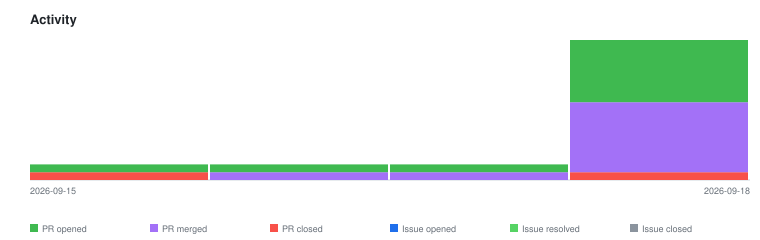

# qte77/gha-arbitrary-repo-timeline — Timeline

<!-- activity-svg-embed -->

## 2026-03-30

- [PR #20] chore: update timelines (2026-03-30) [closed]
- [PR #19] chore: update projects/ timelines (2026-03-30) [open]
- [PR #18] chore: update projects/ timelines (2026-03-30) [closed]
- [PR #15] fix: dispatch input, nested timelines/ paths, state=all, git log (2026-03-29) [open]
- [PR #14] chore: update projects/ timelines (2026-03-29) [closed]
- [PR #13] PR bump-1-main [skip ci bump] (2026-03-29) [closed]
- [PR #12] docs: update CHANGELOG (2026-03-29) [closed]
- [PR #11] chore: update projects/ timelines (2026-03-29) [closed]
- [PR #10] chore: update projects/ timelines (2026-03-28) [closed]
- [PR #9] chore: migrate license to Apache-2.0 (2026-03-27) [closed]
- [PR #8] chore: update projects/ timelines (2026-03-27) [closed]
- [PR #7] chore: update projects/ timelines (2026-03-27) [closed]
- [PR #6] fix: use temp file for tree entries to avoid argument list overflow (2026-03-27) [closed]
- [PR #5] fix: handle empty TIMELINE_REPOS, output to projects/, persist via signed commit (2026-03-26) [closed]
- [PR #3] chore: standardize repo scaffold (2026-03-24) [closed]
- [PR #2] build(deps): Bump callowayproject/bump-my-version from 1.2.7 to 1.3.0 (2026-03-24) [closed]
- [PR #1] feat: add all infra files [TDD GREEN] (2026-03-24) [closed]

## 2026-03-30

- [PR #21] chore: update timelines (2026-03-30) [closed]
- [PR #20] chore: update timelines (2026-03-30) [closed]
- [PR #19] chore: update projects/ timelines (2026-03-30) [closed]
- [PR #18] chore: update projects/ timelines (2026-03-30) [closed]
- [PR #15] fix: dispatch input, nested timelines/ paths, state=all, git log (2026-03-29) [closed]
- [PR #14] chore: update projects/ timelines (2026-03-29) [closed]
- [PR #13] PR bump-1-main [skip ci bump] (2026-03-29) [closed]
- [PR #12] docs: update CHANGELOG (2026-03-29) [closed]
- [PR #11] chore: update projects/ timelines (2026-03-29) [closed]
- [PR #10] chore: update projects/ timelines (2026-03-28) [closed]
- [PR #9] chore: migrate license to Apache-2.0 (2026-03-27) [closed]
- [PR #8] chore: update projects/ timelines (2026-03-27) [closed]
- [PR #7] chore: update projects/ timelines (2026-03-27) [closed]
- [PR #6] fix: use temp file for tree entries to avoid argument list overflow (2026-03-27) [closed]
- [PR #5] fix: handle empty TIMELINE_REPOS, output to projects/, persist via signed commit (2026-03-26) [closed]
- [PR #3] chore: standardize repo scaffold (2026-03-24) [closed]
- [PR #2] build(deps): Bump callowayproject/bump-my-version from 1.2.7 to 1.3.0 (2026-03-24) [closed]
- [PR #1] feat: add all infra files [TDD GREEN] (2026-03-24) [closed]

## 2026-03-31

- [PR #24] docs: add CodeFactor, CodeQL and Dependabot badges (2026-03-30) [open]
- [PR #22] chore: update timelines (2026-03-30) [closed]
- [PR #21] chore: update timelines (2026-03-30) [closed]
- [PR #20] chore: update timelines (2026-03-30) [closed]
- [PR #19] chore: update projects/ timelines (2026-03-30) [closed]
- [PR #18] chore: update projects/ timelines (2026-03-30) [closed]
- [PR #15] fix: dispatch input, nested timelines/ paths, state=all, git log (2026-03-29) [closed]
- [PR #14] chore: update projects/ timelines (2026-03-29) [closed]
- [PR #13] PR bump-1-main [skip ci bump] (2026-03-29) [closed]
- [PR #12] docs: update CHANGELOG (2026-03-29) [closed]
- [PR #11] chore: update projects/ timelines (2026-03-29) [closed]
- [PR #10] chore: update projects/ timelines (2026-03-28) [closed]
- [PR #9] chore: migrate license to Apache-2.0 (2026-03-27) [closed]
- [PR #8] chore: update projects/ timelines (2026-03-27) [closed]
- [PR #7] chore: update projects/ timelines (2026-03-27) [closed]
- [PR #6] fix: use temp file for tree entries to avoid argument list overflow (2026-03-27) [closed]
- [PR #5] fix: handle empty TIMELINE_REPOS, output to projects/, persist via signed commit (2026-03-26) [closed]
- [PR #3] chore: standardize repo scaffold (2026-03-24) [closed]
- [PR #2] build(deps): Bump callowayproject/bump-my-version from 1.2.7 to 1.3.0 (2026-03-24) [closed]
- [PR #1] feat: add all infra files [TDD GREEN] (2026-03-24) [closed]

## 2026-04-01

- [PR #26] chore(deps): bump actions/cache from 4 to 5 (2026-03-31) [closed]
- [PR #25] chore: update timelines (2026-03-31) [closed]
- [PR #24] docs: add CodeFactor, CodeQL and Dependabot badges (2026-03-30) [closed]
- [PR #22] chore: update timelines (2026-03-30) [closed]
- [PR #21] chore: update timelines (2026-03-30) [closed]
- [PR #20] chore: update timelines (2026-03-30) [closed]
- [PR #19] chore: update projects/ timelines (2026-03-30) [closed]
- [PR #18] chore: update projects/ timelines (2026-03-30) [closed]
- [PR #15] fix: dispatch input, nested timelines/ paths, state=all, git log (2026-03-29) [closed]
- [PR #14] chore: update projects/ timelines (2026-03-29) [closed]
- [PR #13] PR bump-1-main [skip ci bump] (2026-03-29) [closed]
- [PR #12] docs: update CHANGELOG (2026-03-29) [closed]
- [PR #11] chore: update projects/ timelines (2026-03-29) [closed]
- [PR #10] chore: update projects/ timelines (2026-03-28) [closed]
- [PR #9] chore: migrate license to Apache-2.0 (2026-03-27) [closed]
- [PR #8] chore: update projects/ timelines (2026-03-27) [closed]
- [PR #7] chore: update projects/ timelines (2026-03-27) [closed]
- [PR #6] fix: use temp file for tree entries to avoid argument list overflow (2026-03-27) [closed]
- [PR #5] fix: handle empty TIMELINE_REPOS, output to projects/, persist via signed commit (2026-03-26) [closed]
- [PR #3] chore: standardize repo scaffold (2026-03-24) [closed]
- [PR #2] build(deps): Bump callowayproject/bump-my-version from 1.2.7 to 1.3.0 (2026-03-24) [closed]

## 2026-04-02

- [PR #27] chore: update timelines (2026-04-01) [closed]
- [PR #26] chore(deps): bump actions/cache from 4 to 5 (2026-03-31) [closed]
- [PR #25] chore: update timelines (2026-03-31) [closed]
- [PR #24] docs: add CodeFactor, CodeQL and Dependabot badges (2026-03-30) [closed]
- [PR #22] chore: update timelines (2026-03-30) [closed]
- [PR #21] chore: update timelines (2026-03-30) [closed]
- [PR #20] chore: update timelines (2026-03-30) [closed]
- [PR #19] chore: update projects/ timelines (2026-03-30) [closed]
- [PR #18] chore: update projects/ timelines (2026-03-30) [closed]
- [PR #15] fix: dispatch input, nested timelines/ paths, state=all, git log (2026-03-29) [closed]
- [PR #14] chore: update projects/ timelines (2026-03-29) [closed]
- [PR #13] PR bump-1-main [skip ci bump] (2026-03-29) [closed]
- [PR #12] docs: update CHANGELOG (2026-03-29) [closed]
- [PR #11] chore: update projects/ timelines (2026-03-29) [closed]
- [PR #10] chore: update projects/ timelines (2026-03-28) [closed]
- [PR #9] chore: migrate license to Apache-2.0 (2026-03-27) [closed]
- [PR #8] chore: update projects/ timelines (2026-03-27) [closed]
- [PR #7] chore: update projects/ timelines (2026-03-27) [closed]
- [PR #6] fix: use temp file for tree entries to avoid argument list overflow (2026-03-27) [closed]
- [PR #5] fix: handle empty TIMELINE_REPOS, output to projects/, persist via signed commit (2026-03-26) [closed]
- [PR #3] chore: standardize repo scaffold (2026-03-24) [closed]
- [PR #2] build(deps): Bump callowayproject/bump-my-version from 1.2.7 to 1.3.0 (2026-03-24) [closed]

## 2026-04-03

- [PR #28] chore: update timelines (2026-04-02) [closed]
- [PR #27] chore: update timelines (2026-04-01) [closed]
- [PR #26] chore(deps): bump actions/cache from 4 to 5 (2026-03-31) [closed]
- [PR #25] chore: update timelines (2026-03-31) [closed]
- [PR #24] docs: add CodeFactor, CodeQL and Dependabot badges (2026-03-30) [closed]
- [PR #22] chore: update timelines (2026-03-30) [closed]
- [PR #21] chore: update timelines (2026-03-30) [closed]
- [PR #20] chore: update timelines (2026-03-30) [closed]
- [PR #19] chore: update projects/ timelines (2026-03-30) [closed]
- [PR #18] chore: update projects/ timelines (2026-03-30) [closed]
- [PR #15] fix: dispatch input, nested timelines/ paths, state=all, git log (2026-03-29) [closed]
- [PR #14] chore: update projects/ timelines (2026-03-29) [closed]
- [PR #13] PR bump-1-main [skip ci bump] (2026-03-29) [closed]
- [PR #12] docs: update CHANGELOG (2026-03-29) [closed]
- [PR #11] chore: update projects/ timelines (2026-03-29) [closed]
- [PR #10] chore: update projects/ timelines (2026-03-28) [closed]
- [PR #9] chore: migrate license to Apache-2.0 (2026-03-27) [closed]
- [PR #8] chore: update projects/ timelines (2026-03-27) [closed]
- [PR #7] chore: update projects/ timelines (2026-03-27) [closed]
- [PR #6] fix: use temp file for tree entries to avoid argument list overflow (2026-03-27) [closed]
- [PR #5] fix: handle empty TIMELINE_REPOS, output to projects/, persist via signed commit (2026-03-26) [closed]
- [PR #3] chore: standardize repo scaffold (2026-03-24) [closed]
- [PR #2] build(deps): Bump callowayproject/bump-my-version from 1.2.7 to 1.3.0 (2026-03-24) [closed]

## 2026-04-04

- [PR #29] chore: update timelines (2026-04-03) [closed]
- [PR #28] chore: update timelines (2026-04-02) [closed]
- [PR #27] chore: update timelines (2026-04-01) [closed]
- [PR #26] chore(deps): bump actions/cache from 4 to 5 (2026-03-31) [closed]
- [PR #25] chore: update timelines (2026-03-31) [closed]
- [PR #24] docs: add CodeFactor, CodeQL and Dependabot badges (2026-03-30) [closed]
- [PR #22] chore: update timelines (2026-03-30) [closed]
- [PR #21] chore: update timelines (2026-03-30) [closed]
- [PR #20] chore: update timelines (2026-03-30) [closed]
- [PR #19] chore: update projects/ timelines (2026-03-30) [closed]
- [PR #18] chore: update projects/ timelines (2026-03-30) [closed]
- [PR #15] fix: dispatch input, nested timelines/ paths, state=all, git log (2026-03-29) [closed]
- [PR #14] chore: update projects/ timelines (2026-03-29) [closed]
- [PR #13] PR bump-1-main [skip ci bump] (2026-03-29) [closed]
- [PR #12] docs: update CHANGELOG (2026-03-29) [closed]
- [PR #11] chore: update projects/ timelines (2026-03-29) [closed]
- [PR #10] chore: update projects/ timelines (2026-03-28) [closed]
- [PR #9] chore: migrate license to Apache-2.0 (2026-03-27) [closed]

## 2026-04-05

- [PR #30] chore: update timelines (2026-04-04) [closed]
- [PR #29] chore: update timelines (2026-04-03) [closed]
- [PR #28] chore: update timelines (2026-04-02) [closed]
- [PR #27] chore: update timelines (2026-04-01) [closed]
- [PR #26] chore(deps): bump actions/cache from 4 to 5 (2026-03-31) [closed]
- [PR #25] chore: update timelines (2026-03-31) [closed]
- [PR #24] docs: add CodeFactor, CodeQL and Dependabot badges (2026-03-30) [closed]
- [PR #22] chore: update timelines (2026-03-30) [closed]
- [PR #21] chore: update timelines (2026-03-30) [closed]
- [PR #20] chore: update timelines (2026-03-30) [closed]
- [PR #19] chore: update projects/ timelines (2026-03-30) [closed]
- [PR #18] chore: update projects/ timelines (2026-03-30) [closed]
- [PR #15] fix: dispatch input, nested timelines/ paths, state=all, git log (2026-03-29) [closed]
- [PR #14] chore: update projects/ timelines (2026-03-29) [closed]
- [PR #13] PR bump-1-main [skip ci bump] (2026-03-29) [closed]
- [PR #12] docs: update CHANGELOG (2026-03-29) [closed]
- [PR #11] chore: update projects/ timelines (2026-03-29) [closed]
- [PR #10] chore: update projects/ timelines (2026-03-28) [closed]
- [PR #9] chore: migrate license to Apache-2.0 (2026-03-27) [closed]

## 2026-04-06

- [PR #31] chore: update timelines (2026-04-05) [closed]
- [PR #30] chore: update timelines (2026-04-04) [closed]
- [PR #29] chore: update timelines (2026-04-03) [closed]
- [PR #28] chore: update timelines (2026-04-02) [closed]
- [PR #27] chore: update timelines (2026-04-01) [closed]
- [PR #26] chore(deps): bump actions/cache from 4 to 5 (2026-03-31) [closed]
- [PR #25] chore: update timelines (2026-03-31) [closed]
- [PR #24] docs: add CodeFactor, CodeQL and Dependabot badges (2026-03-30) [closed]
- [PR #22] chore: update timelines (2026-03-30) [closed]
- [PR #21] chore: update timelines (2026-03-30) [closed]
- [PR #20] chore: update timelines (2026-03-30) [closed]
- [PR #19] chore: update projects/ timelines (2026-03-30) [closed]
- [PR #18] chore: update projects/ timelines (2026-03-30) [closed]
- [PR #15] fix: dispatch input, nested timelines/ paths, state=all, git log (2026-03-29) [closed]
- [PR #14] chore: update projects/ timelines (2026-03-29) [closed]
- [PR #11] chore: update projects/ timelines (2026-03-29) [closed]
- [PR #10] chore: update projects/ timelines (2026-03-28) [closed]

## 2026-04-07

- [PR #32] chore: update timelines (2026-04-06) [closed]
- [PR #31] chore: update timelines (2026-04-05) [closed]
- [PR #30] chore: update timelines (2026-04-04) [closed]
- [PR #29] chore: update timelines (2026-04-03) [closed]
- [PR #28] chore: update timelines (2026-04-02) [closed]
- [PR #27] chore: update timelines (2026-04-01) [closed]
- [PR #26] chore(deps): bump actions/cache from 4 to 5 (2026-03-31) [closed]
- [PR #25] chore: update timelines (2026-03-31) [closed]
- [PR #24] docs: add CodeFactor, CodeQL and Dependabot badges (2026-03-30) [closed]

## 2026-04-08

- [PR #33] chore: update timelines (2026-04-07) [closed]
- [PR #32] chore: update timelines (2026-04-06) [closed]
- [PR #31] chore: update timelines (2026-04-05) [closed]
- [PR #30] chore: update timelines (2026-04-04) [closed]
- [PR #29] chore: update timelines (2026-04-03) [closed]
- [PR #28] chore: update timelines (2026-04-02) [closed]
- [PR #27] chore: update timelines (2026-04-01) [closed]

## 2026-04-09

- [PR #34] chore: update timelines (2026-04-08) [closed]
- [PR #33] chore: update timelines (2026-04-07) [closed]
- [PR #32] chore: update timelines (2026-04-06) [closed]
- [PR #31] chore: update timelines (2026-04-05) [closed]
- [PR #30] chore: update timelines (2026-04-04) [closed]
- [PR #29] chore: update timelines (2026-04-03) [closed]
- [PR #28] chore: update timelines (2026-04-02) [closed]

## 2026-04-10

- [PR #35] chore: update timelines (2026-04-09) [closed]
- [PR #34] chore: update timelines (2026-04-08) [closed]
- [PR #33] chore: update timelines (2026-04-07) [closed]
- [PR #32] chore: update timelines (2026-04-06) [closed]
- [PR #31] chore: update timelines (2026-04-05) [closed]
- [PR #30] chore: update timelines (2026-04-04) [closed]
- [PR #29] chore: update timelines (2026-04-03) [closed]

## 2026-04-11

- [PR #36] chore: update timelines (2026-04-10) [closed]
- [PR #35] chore: update timelines (2026-04-09) [closed]
- [PR #34] chore: update timelines (2026-04-08) [closed]
- [PR #33] chore: update timelines (2026-04-07) [closed]
- [PR #32] chore: update timelines (2026-04-06) [closed]
- [PR #31] chore: update timelines (2026-04-05) [closed]
- [PR #30] chore: update timelines (2026-04-04) [closed]

## 2026-04-12

- [PR #37] chore: update timelines (2026-04-11) [closed]
- [PR #36] chore: update timelines (2026-04-10) [closed]
- [PR #35] chore: update timelines (2026-04-09) [closed]
- [PR #34] chore: update timelines (2026-04-08) [closed]
- [PR #33] chore: update timelines (2026-04-07) [closed]
- [PR #32] chore: update timelines (2026-04-06) [closed]
- [PR #31] chore: update timelines (2026-04-05) [closed]

## 2026-04-13

- [PR #38] chore: update timelines (2026-04-12) [closed]
- [PR #37] chore: update timelines (2026-04-11) [closed]
- [PR #36] chore: update timelines (2026-04-10) [closed]
- [PR #35] chore: update timelines (2026-04-09) [closed]
- [PR #34] chore: update timelines (2026-04-08) [closed]
- [PR #33] chore: update timelines (2026-04-07) [closed]
- [PR #32] chore: update timelines (2026-04-06) [closed]

## 2026-04-14

- [PR #40] chore: rename plugin references to claude-code-plugins (2026-04-13) [closed]
- [PR #39] chore: update timelines (2026-04-13) [closed]
- [PR #38] chore: update timelines (2026-04-12) [closed]
- [PR #37] chore: update timelines (2026-04-11) [closed]
- [PR #36] chore: update timelines (2026-04-10) [closed]
- [PR #35] chore: update timelines (2026-04-09) [closed]
- [PR #34] chore: update timelines (2026-04-08) [closed]
- [PR #33] chore: update timelines (2026-04-07) [closed]

## 2026-04-15

- [PR #42] chore: update timelines (2026-04-14) [closed]
- [PR #40] chore: rename plugin references to claude-code-plugins (2026-04-13) [closed]
- [PR #39] chore: update timelines (2026-04-13) [closed]
- [PR #38] chore: update timelines (2026-04-12) [closed]
- [PR #37] chore: update timelines (2026-04-11) [closed]
- [PR #36] chore: update timelines (2026-04-10) [closed]
- [PR #35] chore: update timelines (2026-04-09) [closed]
- [PR #34] chore: update timelines (2026-04-08) [closed]

## 2026-04-16

- [PR #43] chore: update timelines (2026-04-15) [closed]
- [PR #42] chore: update timelines (2026-04-14) [closed]
- [PR #40] chore: rename plugin references to claude-code-plugins (2026-04-13) [closed]
- [PR #39] chore: update timelines (2026-04-13) [closed]
- [PR #38] chore: update timelines (2026-04-12) [closed]
- [PR #37] chore: update timelines (2026-04-11) [closed]
- [PR #36] chore: update timelines (2026-04-10) [closed]
- [PR #35] chore: update timelines (2026-04-09) [closed]

## 2026-04-17

- [PR #44] chore: update timelines (2026-04-16) [closed]
- [PR #43] chore: update timelines (2026-04-15) [closed]
- [PR #42] chore: update timelines (2026-04-14) [closed]
- [PR #40] chore: rename plugin references to claude-code-plugins (2026-04-13) [closed]
- [PR #39] chore: update timelines (2026-04-13) [closed]
- [PR #38] chore: update timelines (2026-04-12) [closed]
- [PR #37] chore: update timelines (2026-04-11) [closed]
- [PR #36] chore: update timelines (2026-04-10) [closed]

## 2026-04-18

- [PR #45] chore: update timelines (2026-04-17) [closed]
- [PR #44] chore: update timelines (2026-04-16) [closed]
- [PR #43] chore: update timelines (2026-04-15) [closed]
- [PR #42] chore: update timelines (2026-04-14) [closed]
- [PR #40] chore: rename plugin references to claude-code-plugins (2026-04-13) [closed]
- [PR #39] chore: update timelines (2026-04-13) [closed]
- [PR #38] chore: update timelines (2026-04-12) [closed]
- [PR #37] chore: update timelines (2026-04-11) [closed]

## 2026-04-19

- [PR #47] docs: standardize README to GHA conventions (2026-04-18) [closed]
- [PR #46] chore: update timelines (2026-04-18) [closed]
- [PR #45] chore: update timelines (2026-04-17) [closed]
- [PR #44] chore: update timelines (2026-04-16) [closed]
- [PR #43] chore: update timelines (2026-04-15) [closed]
- [PR #42] chore: update timelines (2026-04-14) [closed]
- [PR #40] chore: rename plugin references to claude-code-plugins (2026-04-13) [closed]
- [PR #39] chore: update timelines (2026-04-13) [closed]
- [PR #38] chore: update timelines (2026-04-12) [closed]

## 2026-04-20

- [PR #48] chore: update timelines (2026-04-19) [closed]
- [PR #47] docs: standardize README to GHA conventions (2026-04-18) [closed]
- [PR #46] chore: update timelines (2026-04-18) [closed]
- [PR #45] chore: update timelines (2026-04-17) [closed]
- [PR #44] chore: update timelines (2026-04-16) [closed]
- [PR #43] chore: update timelines (2026-04-15) [closed]
- [PR #42] chore: update timelines (2026-04-14) [closed]
- [PR #40] chore: rename plugin references to claude-code-plugins (2026-04-13) [closed]
- [PR #39] chore: update timelines (2026-04-13) [closed]

## 2026-04-21

- [PR #49] chore: update timelines (2026-04-20) [closed]
- [PR #48] chore: update timelines (2026-04-19) [closed]
- [PR #47] docs: standardize README to GHA conventions (2026-04-18) [closed]
- [PR #46] chore: update timelines (2026-04-18) [closed]
- [PR #45] chore: update timelines (2026-04-17) [closed]
- [PR #44] chore: update timelines (2026-04-16) [closed]
- [PR #43] chore: update timelines (2026-04-15) [closed]
- [PR #42] chore: update timelines (2026-04-14) [closed]

## 2026-04-22

- [PR #50] chore: update timelines (2026-04-21) [closed]
- [PR #49] chore: update timelines (2026-04-20) [closed]
- [PR #48] chore: update timelines (2026-04-19) [closed]
- [PR #47] docs: standardize README to GHA conventions (2026-04-18) [closed]
- [PR #46] chore: update timelines (2026-04-18) [closed]
- [PR #45] chore: update timelines (2026-04-17) [closed]
- [PR #44] chore: update timelines (2026-04-16) [closed]
- [PR #43] chore: update timelines (2026-04-15) [closed]

## 2026-04-23

- [PR #51] chore: update timelines (2026-04-22) [closed]
- [PR #50] chore: update timelines (2026-04-21) [closed]
- [PR #49] chore: update timelines (2026-04-20) [closed]
- [PR #48] chore: update timelines (2026-04-19) [closed]
- [PR #47] docs: standardize README to GHA conventions (2026-04-18) [closed]
- [PR #46] chore: update timelines (2026-04-18) [closed]
- [PR #45] chore: update timelines (2026-04-17) [closed]
- [PR #44] chore: update timelines (2026-04-16) [closed]

## 2026-04-24

- [PR #54] fix: dedup timeline entries by ID token, merge same-day sections (2026-04-23) [closed]
- [PR #53] chore: align LICENSE with canonical ASF Apache-2.0 text (2026-04-23) [closed]
- [PR #52] chore: update timelines (2026-04-23) [closed]
## 2026-04-25

- [PR #55] chore: update timelines (2026-04-24) [closed]
## 2026-04-26

- [PR #56] chore: update timelines (2026-04-25) [closed]
## 2026-04-27

- [PR #57] chore: update timelines (2026-04-26) [closed]
## 2026-04-28

- [PR #65] chore(lint): bump SHA pin and apply inference fixes (2026-04-27) [closed]
- [PR #64] revert(ci): remove lint-monitor scaffold (2026-04-27) [closed]
- [PR #63] ci(lint): bump SHA pin and add scheduled monitor (2026-04-27) [closed]
- [PR #62] ci(lint): adopt centralized markdown + link checking (2026-04-27) [closed]
- [PR #61] test(bats): drop assertion on .github/ISSUE_TEMPLATE presence (2026-04-27) [closed]
- [PR #60] chore(cascade): remove redundant community files (2026-04-27) [closed]
- [PR #59] fix(plugins): correct marketplace name to qte77-claude-code-utils (2026-04-27) [closed]
- [PR #58] chore: update timelines (2026-04-27) [closed]
## 2026-04-29

- [PR #66] chore: update timelines (2026-04-28) [closed]
## 2026-04-30

- [PR #70] chore: update timelines (2026-04-29) [closed]
- [PR #69] chore: update timelines (2026-04-29) [closed]
- [PR #68] chore: update timelines (2026-04-29) [closed]
- [PR #67] chore: update timelines (2026-04-29) [closed]
## 2026-05-01

- [PR #71] chore: update timelines (2026-04-30) [closed]
## 2026-05-02

- [PR #72] chore: update timelines (2026-05-01) [closed]
## 2026-05-03

- [PR #75] chore: local dev infra (Makefile, CONTRIBUTING, plugins) (2026-05-03) [open]
- [PR #74] chore: update timelines (2026-05-03) [closed]
- [PR #73] chore: update timelines (2026-05-02) [closed]
## 2026-05-04

- [PR #76] chore: update timelines (2026-05-03) [closed]
## 2026-05-05

- [PR #77] chore: update timelines (2026-05-04) [closed]
## 2026-05-06

- [PR #78] chore: update timelines (2026-05-05) [closed]
## 2026-05-07

- [PR #79] chore: update timelines (2026-05-06) [closed]
## 2026-05-08

- [PR #80] chore: update timelines (2026-05-07) [closed]
- [PR #84] feat: themed activity SVG per repo (2026-05-08) [open]
- [PR #82] fix(ci): bump lint workflow SHA pin to 55ea1a99 (2026-05-08) [closed]
- [PR #81] chore: update timelines (2026-05-08) [closed]
- [PR #85] chore: update timelines (2026-05-08) [closed]- [PR #90] feat: event-based activity categories with color-coded legend (2026-05-08) [open]
- [PR #89] chore: update timelines (2026-05-08) [closed]- [PR #95] fix: refresh SVG every run + paginate issues endpoint (2026-05-08) [closed]
- [PR #94] chore: update timelines (2026-05-08) [closed]
- [PR #93] chore: update timelines (2026-05-08) [closed]
- [PR #92] chore: update timelines (2026-05-08) [closed]
- [PR #91] chore: update timelines (2026-05-08) [closed]- [ISSUE #97] feat: persist cumulative activity TSV history per repo (2026-05-08) [open]
- [ISSUE #88] ci: invoke make validate (lint_sh + format_sh_check + test) instead of bats directly (2026-05-08) [open]
- [ISSUE #87] feat: cross-repo overview SVG and timelines/README.md index (2026-05-08) [open]
- [ISSUE #86] feat: restructure timeline MD with rolling Open + collapsed History sections (2026-05-08) [open]
- [ISSUE #83] consider replacing hand-rolled awk SVG renderer with mermaid or vega-lite (2026-05-08) [open]
- [PR #98] fix(ci): grant issues: read to GITHUB_TOKEN (2026-05-08) [closed]
- [PR #96] chore: update timelines (2026-05-08) [closed]- [PR #99] chore: update timelines (2026-05-08) [closed]## 2026-05-09

- [PR #101] chore: update timelines (2026-05-08) [closed]
- [PR #100] chore: update timelines (2026-05-08) [closed]
## 2026-05-09

- [PR #106] feat: persist cumulative activity TSV per repo (2026-05-09) [closed]
- [PR #105] chore: add .gitignore for local dev artifacts (2026-05-09) [closed]
- [PR #104] docs: catch up CHANGELOG with merged PRs (2026-05-09) [closed]
- [PR #103] ci: invoke make validate (lint_sh + format_sh_check + test) (2026-05-09) [closed]
- [PR #102] chore: update timelines (2026-05-09) [closed]
## 2026-05-10

- [ISSUE #110] policy: privacy guardrails baseline for contributor / OSINT-style features (2026-05-09) [open]
- [ISSUE #109] feat: account-level meta tracker — repos timeline, theme inference, external contributions (2026-05-09) [open]
- [ISSUE #108] feat: temporal analysis of contributions (when contributors are active) (2026-05-09) [open]
- [PR #107] chore: update timelines (2026-05-09) [closed]
## 2026-05-11

- [PR #112] docs: document SVG + TSV outputs and add Example output section (2026-05-10) [closed]
- [PR #111] chore: update timelines (2026-05-10) [closed]
## 2026-05-12

- [ISSUE #4] feat: add contributor & repo intelligence collection (Phase 2) (2026-03-26) [open]
- [PR #113] chore: update timelines (2026-05-11) [closed]
## 2026-05-13

- [PR #115] chore: update timelines (2026-05-12) [closed]
- [PR #114] chore: update timelines (2026-05-12) [closed]
## 2026-05-14

- [PR #116] chore: update timelines (2026-05-13) [closed]
## 2026-05-15

- [PR #117] chore: update timelines (2026-05-14) [closed]
## 2026-05-16

- [PR #118] chore: update timelines (2026-05-15) [closed]
## 2026-05-17

- [PR #119] chore: update timelines (2026-05-16) [closed]
## 2026-05-18

- [PR #120] chore: update timelines (2026-05-17) [closed]
## 2026-05-19

- [PR #121] chore: update timelines (2026-05-18) [closed]
## 2026-05-20

- [PR #122] chore: update timelines (2026-05-19) [closed]
## 2026-05-21

- [PR #123] chore: update timelines (2026-05-20) [closed]
## 2026-05-22

- [PR #124] chore: update timelines (2026-05-21) [closed]
## 2026-05-23

- [PR #125] chore: update timelines (2026-05-22) [closed]
## 2026-05-24

- [PR #126] chore: update timelines (2026-05-23) [closed]
## 2026-05-25

- [PR #127] chore: update timelines (2026-05-24) [closed]
## 2026-05-26

- [PR #128] chore: update timelines (2026-05-25) [closed]
## 2026-05-27

- [PR #129] chore: update timelines (2026-05-26) [closed]
## 2026-05-28

- [PR #130] chore: update timelines (2026-05-27) [closed]
## 2026-05-29

- [PR #131] chore: update timelines (2026-05-28) [closed]
## 2026-05-30

- [PR #132] chore: update timelines (2026-05-29) [closed]
## 2026-05-31

- [PR #133] chore: update timelines (2026-05-30) [closed]
## 2026-06-01

- [PR #134] chore: update timelines (2026-05-31) [closed]
## 2026-06-02

- [PR #135] chore: update timelines (2026-06-01) [closed]
## 2026-06-03

- [PR #136] chore: update timelines (2026-06-02) [closed]
## 2026-06-04

- [PR #137] chore: update timelines (2026-06-03) [closed]
## 2026-06-05

- [PR #138] chore: update timelines (2026-06-04) [closed]
## 2026-06-06

- [PR #139] chore: update timelines (2026-06-05) [closed]
## 2026-06-07

- [PR #140] chore: update timelines (2026-06-06) [closed]
## 2026-06-08

- [PR #141] chore: update timelines (2026-06-07) [closed]
## 2026-06-09

- [PR #142] chore: update timelines (2026-06-08) [closed]
## 2026-06-10

- [PR #143] chore: update timelines (2026-06-09) [closed]
## 2026-06-11

- [PR #144] chore: update timelines (2026-06-10) [closed]
## 2026-06-12

- [PR #145] chore: update timelines (2026-06-11) [closed]
## 2026-06-13

- [PR #146] chore: update timelines (2026-06-12) [closed]
## 2026-06-14

- [PR #147] chore: update timelines (2026-06-13) [closed]
## 2026-06-15

- [PR #156] chore: update timelines (2026-06-14) [closed]
- [PR #155] chore: update timelines (2026-06-14) [closed]
- [PR #154] chore: update timelines (2026-06-14) [closed]
- [PR #153] chore: update timelines (2026-06-14) [closed]
- [PR #152] chore: update timelines (2026-06-14) [closed]
- [PR #151] chore: update timelines (2026-06-14) [closed]
- [PR #150] chore: update timelines (2026-06-14) [closed]
- [PR #149] docs: drop Apache LICENSE APPENDIX section (end at END OF TERMS AND CONDITIONS) (2026-06-14) [open]
- [PR #148] chore: update timelines (2026-06-14) [closed]
## 2026-06-16

- [PR #157] chore: update timelines (2026-06-15) [closed]
## 2026-06-17

- [PR #158] chore: update timelines (2026-06-16) [closed]
## 2026-06-18

- [PR #159] chore: update timelines (2026-06-17) [closed]
## 2026-06-19

- [PR #160] chore: update timelines (2026-06-18) [closed]
## 2026-06-20

- [PR #161] chore: update timelines (2026-06-19) [closed]
## 2026-06-21

- [PR #162] chore: update timelines (2026-06-20) [closed]
## 2026-06-22

- [ISSUE #164] docs: adopt README doc-structure canon (2026-06-21) [open]
- [PR #163] chore: update timelines (2026-06-21) [closed]
## 2026-06-23

- [PR #165] chore: update timelines (2026-06-22) [closed]
## 2026-06-24

- [PR #168] chore(deps): Bump callowayproject/bump-my-version from 1.3.0 to 1.4.1 (2026-06-23) [open]
- [PR #167] chore(deps): Bump actions/checkout from 6 to 7 (2026-06-23) [open]
- [PR #166] chore: update timelines (2026-06-23) [closed]
## 2026-06-25

- [PR #169] chore: update timelines (2026-06-24) [closed]
## 2026-06-26

- [PR #170] chore: update timelines (2026-06-25) [closed]
## 2026-06-27

- [PR #171] chore: update timelines (2026-06-26) [closed]
## 2026-06-28

- [PR #172] chore: update timelines (2026-06-27) [closed]
## 2026-06-29

- [ISSUE #174] chore(ci): adopt qte77/.github reusable release workflows (2026-06-28) [open]
- [PR #173] chore: update timelines (2026-06-28) [closed]
## 2026-06-30

- [PR #175] chore: update timelines (2026-06-29) [closed]
## 2026-07-01

- [PR #177] chore(deps): Bump actions/cache from 5 to 6 (2026-06-30) [open]
- [PR #176] chore: update timelines (2026-06-30) [closed]
## 2026-07-02

- [PR #178] chore: update timelines (2026-07-01) [closed]
## 2026-07-03

- [PR #179] chore: update timelines (2026-07-02) [closed]
## 2026-07-04

- [PR #180] chore: update timelines (2026-07-03) [closed]
## 2026-07-05

- [PR #181] chore: update timelines (2026-07-04) [closed]
## 2026-07-06

- [PR #182] chore: update timelines (2026-07-05) [closed]
## 2026-07-07

- [PR #183] chore: update timelines (2026-07-06) [closed]
## 2026-07-08

- [PR #184] chore: update timelines (2026-07-07) [closed]
## 2026-07-09

- [PR #185] chore: update timelines (2026-07-08) [closed]
## 2026-07-10

- [PR #186] chore: update timelines (2026-07-09) [closed]
## 2026-07-11

- [PR #187] chore: update timelines (2026-07-10) [closed]
## 2026-07-12

- [PR #188] chore: update timelines (2026-07-11) [closed]
## 2026-07-13

- [PR #189] chore: update timelines (2026-07-12) [closed]
