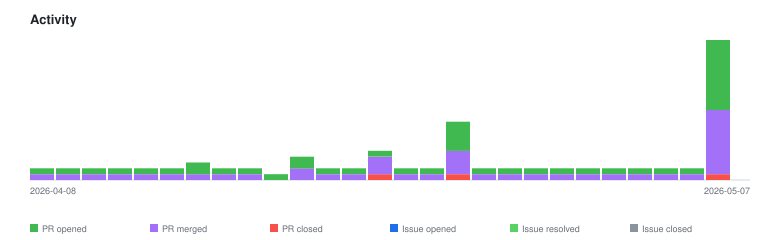

# qte77/gha-biorxiv-stats-action — Timeline

<!-- activity-svg-embed -->

## 2026-04-29

- [PR #61] chore: update ./data (2026-04-29) [closed]
- [PR #60] chore: update ./data (2026-04-28) [closed]
- [PR #59] chore(lint): bump SHA pin and apply inference fixes (2026-04-27) [closed]
- [PR #58] revert(ci): remove lint-monitor scaffold (2026-04-27) [closed]
- [PR #57] ci(lint): bump SHA pin and add scheduled monitor (2026-04-27) [closed]
- [PR #56] ci(lint): adopt centralized markdown + link checking (2026-04-27) [closed]
- [PR #55] chore: update ./data (2026-04-27) [closed]
- [PR #54] chore: update ./data (2026-04-26) [closed]
- [PR #53] chore: update ./data (2026-04-25) [closed]
- [PR #52] chore: align LICENSE with canonical ASF Apache-2.0 text (2026-04-23) [closed]
- [PR #47] chore: update ./data (2026-04-17) [closed]
- [PR #44] Chore(deps-dev): bump pytest from 9.0.2 to 9.0.3 in the uv group across 1 directory (2026-04-14) [closed]
- [PR #31] Chore(deps): bump astral-sh/setup-uv from 6 to 7 (2026-04-02) [closed]
## 2026-05-08

- [PR #83] chore: rename workflow to update-rxiv-feed (drop 'stats') (2026-05-07) [closed]
- [PR #82] chore: finish #78 rename — pyproject + categories.md link (2026-05-07) [closed]
- [PR #81] chore: rename workflow to update-rxiv-feed (drop 'stats') (2026-05-07) [closed]
- [PR #80] feat: matrix workflow for biorxiv + medrxiv (2026-05-07) [closed]
- [PR #79] chore: update ./data (2026-05-07) [closed]
- [PR #78] chore: update repo references to gha-rxiv-stats-action (2026-05-07) [closed]
- [PR #77] docs: matrix usage example + categories doc cross-link (2026-05-07) [closed]
- [PR #76] feat: client-side category filter + CSV prune (2026-05-07) [closed]
- [PR #75] chore: expand .gitignore (2026-05-07) [closed]
- [PR #74] chore: pin all workflow actions to full-length SHAs (2026-05-07) [closed]
- [PR #73] fix: grant issues:write so reusable lint workflow can start (2026-05-07) [closed]
- [PR #71] chore: update ./data (2026-05-07) [closed]
- [PR #68] chore: update ./data (2026-05-06) [closed]
- [PR #67] chore: update ./data (2026-05-05) [closed]
- [PR #66] chore: update ./data (2026-05-04) [closed]
- [PR #65] chore: update ./data (2026-05-03) [closed]
- [PR #64] chore: update ./data (2026-05-02) [closed]
- [PR #63] chore: update ./data (2026-05-01) [closed]
